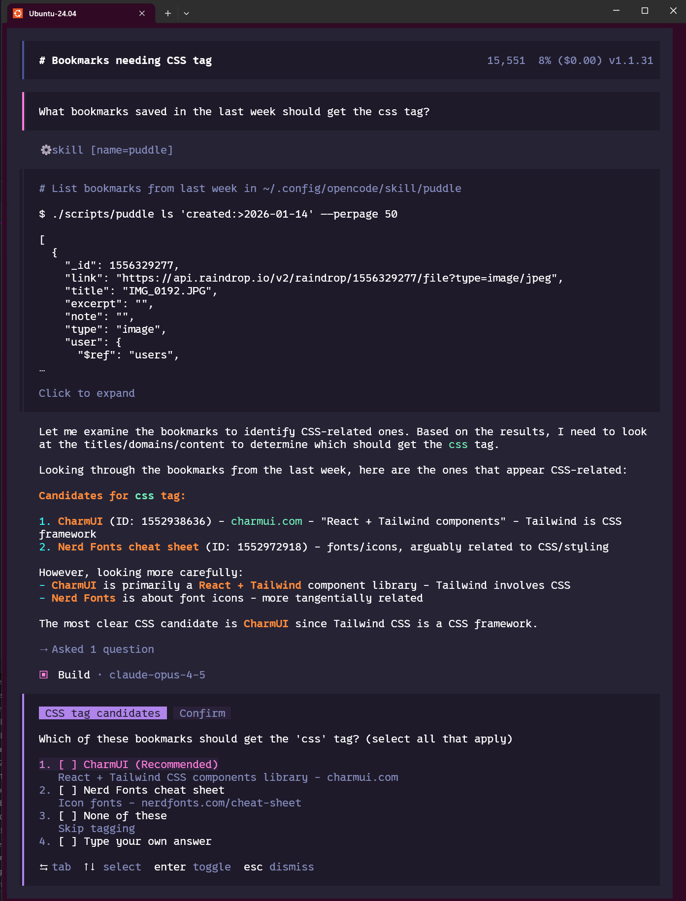

# puddle

Bash CLI for managing [Raindrop.io](https://raindrop.io) bookmarks. Designed for AI agents to programmatically search, create, update, and organize bookmarks.



## Requirements

- **bash** 4.0+
- **curl**
- **jq** (JSON processor)

Most Unix-like systems have these installed. On macOS:

```bash
brew install jq
```

On Debian/Ubuntu:

```bash
sudo apt install jq curl
```

## Installation

```bash
npx skills add ethanfann/puddle
```

## Getting an API Token

1. Go to [Raindrop.io Integrations](https://app.raindrop.io/settings/integrations)
2. Click **Create new app** under "For Developers"
3. Name your app (e.g., "puddle-cli")
4. Click **Create Test Token**
5. Copy the token

**Note:** Test tokens have full access to your account. Keep them secure.

## Token Configuration

Configure your token using one of these methods (in order of precedence):

### Option 1: Command-line flag (highest priority)
```bash
puddle --token "your-token-here" ls
```

### Option 2: Environment variable
```bash
export RAINDROP_TOKEN="your-token-here"
puddle ls
```

### Option 3: Config file
```bash
mkdir -p ~/.config/puddle
echo "your-token-here" > ~/.config/puddle/token
chmod 600 ~/.config/puddle/token  # Secure the file
puddle ls
```

## Quick Start

```bash
# List recent bookmarks
puddle ls

# Search by tag
puddle ls '#react'

# Search by type
puddle ls 'type:article'

# Add a bookmark
puddle add 'https://example.com' --title 'Example' --tags 'reference,docs'

# Get a specific bookmark
puddle get 12345678

# Update a bookmark
puddle update 12345678 --tags 'updated,tags' --important true

# Delete a bookmark
puddle rm 12345678

# List collections
puddle collections
```

## Commands

| Command | Description |
|---------|-------------|
| `ls [search]` | List/search bookmarks |
| `get <id>` | Get a single bookmark |
| `add <url>` | Create a new bookmark |
| `update <id>` | Update a bookmark |
| `rm <id>` | Delete a bookmark (moves to Trash) |
| `tag add\|rm <tag> --search '...'` | Bulk add/remove tags |
| `move <collection-id> --search '...'` | Bulk move bookmarks |
| `collections` | List all collections |

## Search Examples

```bash
# By tag
puddle ls '#javascript'

# By type
puddle ls 'type:video'

# By domain
puddle ls 'domain:github.com'

# By date
puddle ls 'created:>2024-01-01'

# Combined
puddle ls '#tutorial type:article domain:medium.com'

# Untagged bookmarks
puddle ls 'notag:true'
```

See [skills/puddle/references/search-dsl.md](skills/puddle/references/search-dsl.md) for complete search syntax.

## Output Processing

All data output is JSON. Use `jq` for processing:

```bash
# Extract URLs
puddle ls '#react' | jq -r '.[].link'

# Count results
puddle ls '#project' | jq 'length'

# Get IDs and titles
puddle ls 'type:article' | jq '.[] | {id: ._id, title}'
```

## Bulk Operations

```bash
# Add tag to all matching bookmarks
puddle tag add 'archived' --search 'created:<2023-01-01'

# Remove tag
puddle tag rm 'old' --search '#old'

# Move bookmarks to collection
puddle move 12345 --search '#project-done'
```

## Exit Codes

| Code | Meaning |
|------|---------|
| 0 | Success |
| 1 | General error (missing token, invalid args, network error) |
| 2 | API error (4xx response) |
| 3 | Not found / Invalid ID |

## Global Options

```
--token <token>    Override token for this command
--json             Output errors as JSON (for scripting)
--version          Show version
--help             Show help
```

## Documentation

- [skills/puddle/SKILL.md](skills/puddle/SKILL.md) - Agent skills reference (for AI assistants)
- [skills/puddle/references/search-dsl.md](skills/puddle/references/search-dsl.md) - Complete search syntax reference

## License

MIT
